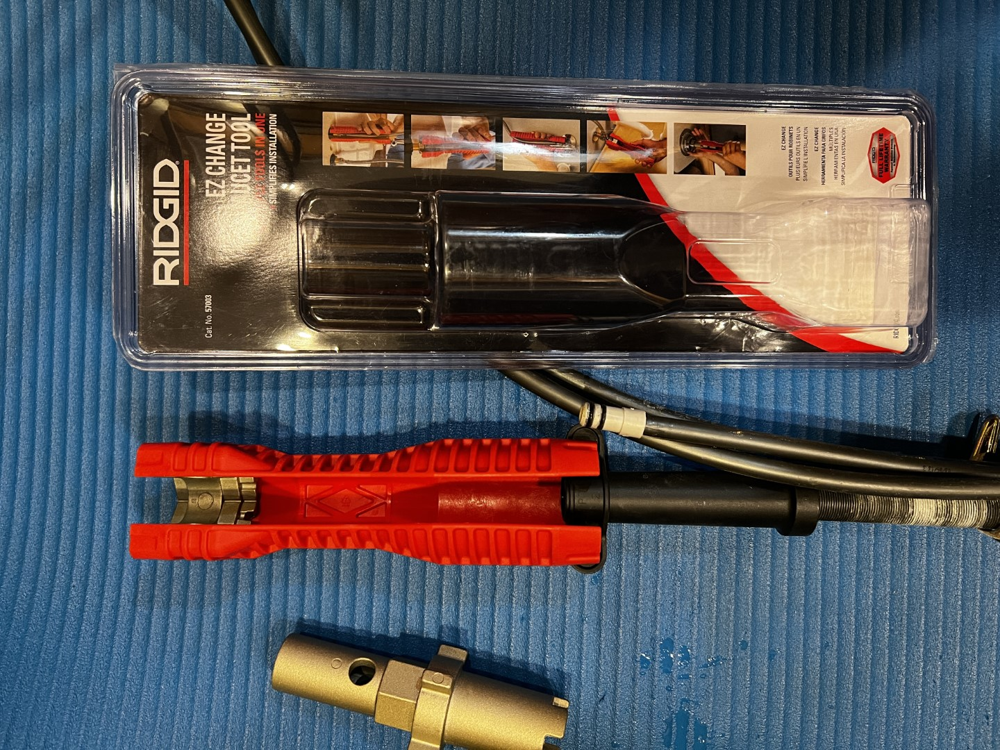

Some Delta single-hole faucets use a large nut that screws onto a long stem to tighten a clamp that grips the countertop. It can be a challenge both to firmly tighten that nut as well as to loosen it, since the fins are small on the wrench that Delta includes with those faucets.

However, I discovered that those small fins happen to fit neatly into one of the sets of slots on the Ridgid EZ Change Faucet Tool (Cat. No. 57003) as you can see here:

The large gripping surface on the Ridgid tool made it much easier for me to adjust the nut.
