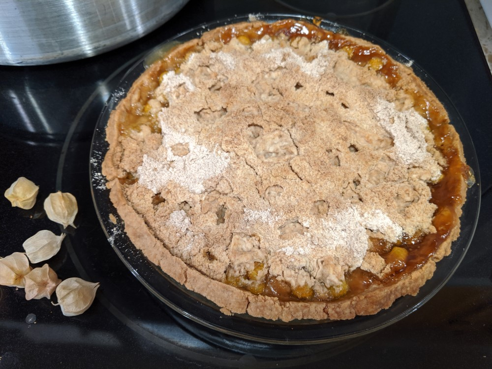
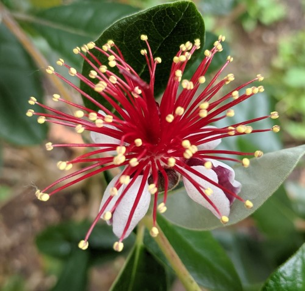
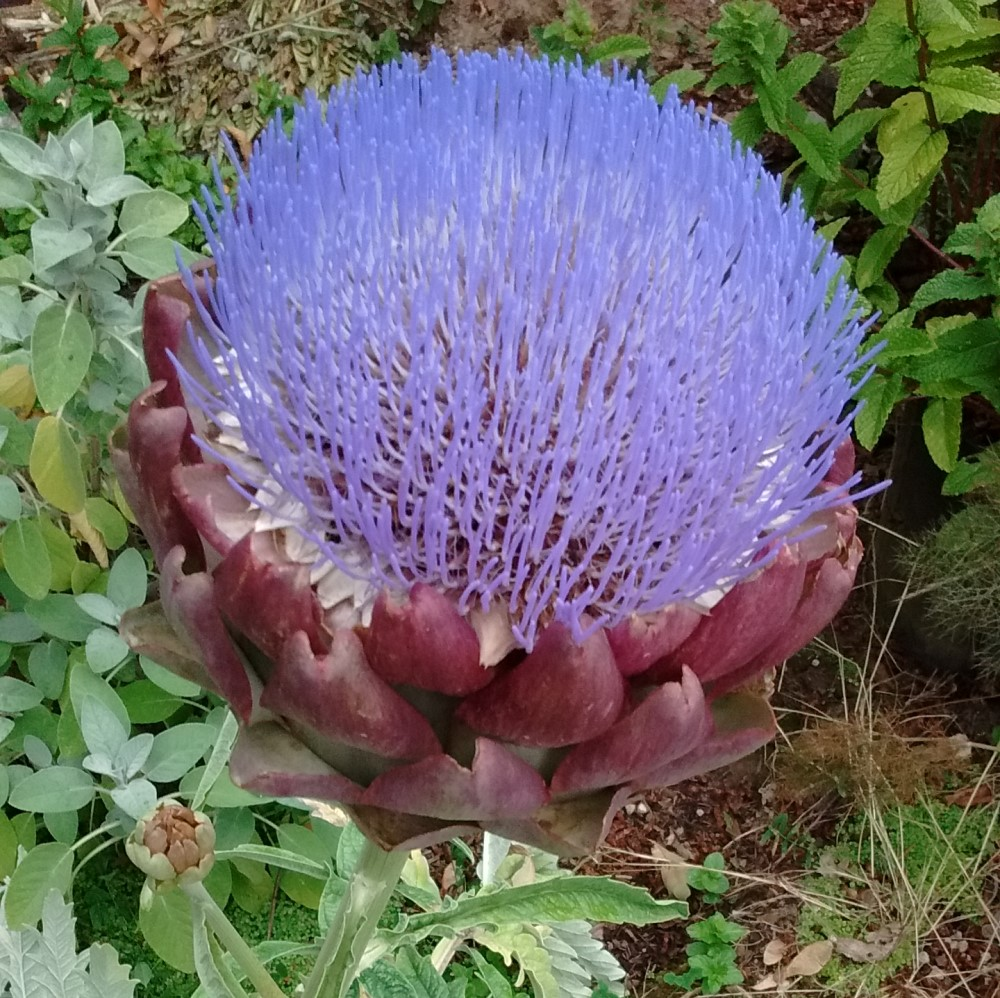

My family and I have been cultivating our backyard (and front yard) garden in a suburb of Portland, Oregon, for eight years.
I grew up in central Wisconsin pulling weeds from rows of beans and strawberries, and my wife was a patio
gardener during her childhood and in grad school.  We enjoyed growing a tray of culinary herbs together in our apartment as
newlyweds while finishing grad school.  The University of Illinois has a long agricultural legacy, and we enjoyed touring the student-run farm during our time there.  We were excited to expand to backyard
gardening as soon as we purchased a house. Growing space was one of the main criteria in our minds as we were browsing house listings.

A fun aspect of backyard gardening is the ability to grow unusual and heirloom varieties of plants that are
too delicate or esoteric for stores to stock.  We grow both a vegetable garden as well as a small "orchard"
with a wide variety of fruits.  This also has the benefit of spacing out harvests based on when each type of fruit ripens.  The mild weather west of the Cascades opens up a wide selection of fruit
trees and vines.  This was especially exciting for me having grown up browsing garden nursery
catalogs and realizing how few types of fruits can tolerate Wisconsin's winters.

Local garden nurseries offer many vegetable seedlings, but we grow most of our plants from seed (starting them in our garage) to gain
access to an even wider assortment and to minimize costs.  A heating mat seems to increase germination rates
(e.g. https://territorialseed.com/products/heat-mat-electra-grow), and we use a grow light to make up for a
dearth of sunny windowsills in our house (e.g. https://www.homedepot.com/p/ViaVolt-2-ft-4-Bulb-T5-High-Output-Copper-Fluorescent-Grow-Light-Fixture-V24/202985194).  I like to support our local seed suppliers such as https://territorialseed.com/, but I still also put in orders to another one
on the opposite side of the country: https://www.johnnyseeds.com/  They have a great selection, and they are
my parents' favorite seed supplier.

There is a wealth of resources available online with gardening guidance, and I listed some of my favorites below.  Many of these are specific to the Portland area.

## Vegetable gardening resources
 - [Schedule for when to start and transplant vegetables](https://portlandnursery.com/docs/veggies/VeggieCalendar.pdf)
 - [OSU Extension guide for vegetable gardening](https://catalog.extension.oregonstate.edu/sites/catalog/files/project/pdf/ec871.pdf)
 - [Other vegetable growing info from Portland Nursery](https://portlandnursery.com/veggies/)
 - [Tualitin Valley Garden Club with additional tips in their newsletter and an annual plant sale](http://www.tualatinvalleygardenclub.org/)
 - [Washington County Master Gardeners](http://washingtoncountymastergardeners.org/)
 - [Storage life expectancy for seeds](https://www.johnnyseeds.com/on/demandware.static/-/Library-Sites-JSSSharedLibrary/default/dw913ac4d0/assets/information/seed-storage-guide.pdf)

One of the biggest factors in whether each year's garden is a success is whether my transplanted seedlings became cold-shocked due to being planted too early.  Another big factor is the quality of the soil.  Ironically, improving the quality of the soil that I used for seed starting in 2019 led to a terrible tomato harvest that year due to the seedlings quickly getting too tall for my seed-starting shelf.  I was forced to transplant them far too early (late March), about a month after starting them.  The weather also happened to be cold that Spring, compounding the problem.  Good soil is always a positive, so I shifted my seed-starting dates back by a couple of months in 2020 to hopefully avoid a repeat of this problem.  I talk more in the next section about developing soil quality.

Even when particular crops struggle in any given year, there are usually other crops that thrive, which helps
to balance things out.  It varies each year depending on weather and how I tend the plants.  Some years, we
struggle to keep up with our tomato harvest.  In 2019, even though the tomato harvest was light, we
enjoyed a consistent supply of green beans.

## Developing rich soil

Organic matter and nutrients can be quickly consumed by growing veggies or washed away in our wet winters.
So, I need to add sizable quantities of compost to my garden beds, lawn, and orchard to keep up.  Buying compost
in small bags is expensive for large quantities, so it was actually much more economical for me to order a
bulk delivery from a local supplier, e.g. https://shbark.com/products/sandh-premium-compost.

We also maintain a worm bin to transform our veggie scraps into compost.

## Fruit tree and berry resources
 - [OSU extension guide with recommended varieties of fruit trees](https://catalog.extension.oregonstate.edu/sites/catalog/files/project/pdf/ec819.pdf)
 - [Guide to some berries that grow well in the PNW](http://grownorthwest.com/2013/03/fruits-and-berries-the-basics-of-growing-at-home/)
   - Another type of berry that we enjoy growing is the Goji berry.  However, it spreads like bamboo!  I had to dig out my first one for that reason and replant one in a wine barrel to keep it contained.

## General resources

["Growing a Greener World"](https://www.growingagreenerworld.com/) has a lot of inspiring and informative programs.  For example, it has [ideas for large, sturdy tomato trellises](https://www.growingagreenerworld.com/best-tomato-support-criteria/).  The small ones commonly sold at stores are inadequate for many types of tomatoes.

## Favorite plant varieties

Here are some of our favorite varieties of plants that we have grown through the years.  We don't have enough
space to grow them all at once, so we rotate through these along with trying new things each year:

### Vegetables
 - Cucurbits
   - Sour Gherkins
 - Husk cherries
   - Goldie (A recommendation from someone who I met while walking past the community gardens in Bethany Lake Park.) 
 - Lettuce (important to pick varieties that resist bitterness)
   - Green romaine
   - Red oak leaf
 - Melons
   - Savor Charentais
 - Peas
   - Austrian field peas as a winter cover crop that is also great as a salad
   - Snow peas
     - Oregon Giant
     - Oregon Sugar Pod II
 - Peppers
   - Baron poblano
   - Jedi jalapeno
   - King Arthur bell
   - Red Ember cayenne
 - Radish
   - Tricolor
 - Squash
   - Delicata
   - North Georgia Candy Roaster
 - Tomatoes
   - Cherry
     - Indigo Cherry
     - Mountain Magic
       - This, Defiant, and Plum Regal were all developed recently at UW-Madison.
     - Yellow Cherry
   - Mid-size
     - Defiant
     - New Girl
   - Plum (for sauce)
     - Plum Regal
   - Slicer/beefsteak
     - Big Beef

### Fruits
 - Blackberry
   - Ardenberry (purchased directly from its namesake, the former county extension agent for our area, Mr. Arden, at the Tualitin Valley Garden Club sale)
   - Obsidian
   - Triple Crown thornless
 - Fig
   - Brown Turkey
 - Goji
 - Honeyberries
 - Kiwi
   - Arctic Beauty
 - Peach
   - PixZee
 - Raspberry
   - Fallgold
   - Some red summer-bearing variety
 - Strawberries
   - Delizz (day-neutral variety so that it produces much of the year)

### Flowers
- Feijoa/Pineapple Guava 
  - This doesn't fruit here, but we enjoy eating the sweet-tasting flower petals.
- Passionflower 
  - I haven't yet succeeded in keeping it alive longer than a couple of years, though.
  - I have harvested a few passionfruits, but our yard doesn't have the carpenter bees that are
    needed for them to produce full fruits,  Instead, each fruit had only a few developed seeds.
- African marigold
  - These get quite tall and keep flowering late into Fall.
- American giant sunflowers
  - Very tall!  We even managed to harvest some of the seeds last year before the squirrels.
- Hardy Fuchsia
  - This is a favorite for hummingbirds.
- Rosemary
  - The previous owners planted this, and it helps to sustain over-wintering hummingbirds with its bountiful blossoms that appear early in the year.  The whole family really enjoys it on grilled cheese, too.
- Artichoke
  - This may seem a better fit for the vegetable section, but the flowers are so stunning that I don't harvest them for food.  It's especially fun to watch bumblebees crawl through these. 
